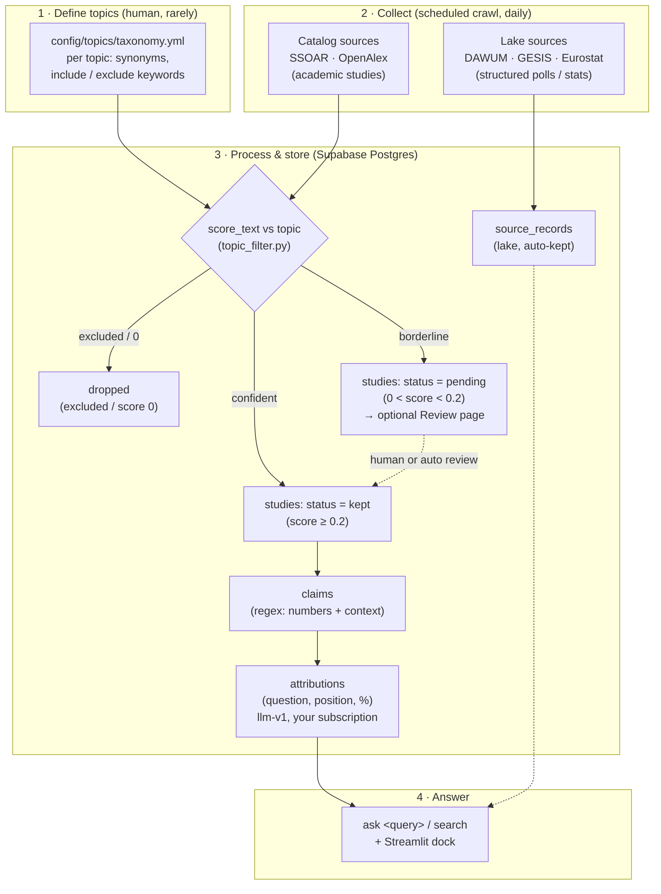

# FLOW — how the study scraper works, end to end

A single picture of how a topic becomes an answer. Four stages:
**define topics → collect → process & store → answer.** Everything below
runs automatically on a schedule (see `AUTONOMY.md`); humans are optional.

## The diagram

## The four stages in words

### 1 · How topic definitions are created
- **File:** `config/topics/taxonomy.yml` (hand-authored, changes rarely).
- Each topic (e.g. `klima`, `steuern`) has German + English **synonyms**,
  **include_keywords**, and **exclude_keywords**.
- The classifier (`topic_filter.py` → `score_text`) turns a study's
  title+abstract into a **0–1 relevance score** against a topic.
- To add/adjust a topic: edit this file (or open an `agent:task` and let
  the developer agent do it).

### 2 · What kind of studies, and from where
Two independent input types:
- **Catalog (→ `studies`):** academic/representative studies from
  **SSOAR** and **OpenAlex**. Topic-filtered at ingest.
- **Lake (→ `source_records`):** ready-made structured data —
  **DAWUM** (polls), **GESIS** (catalog), **Eurostat** (stats, `geo=DE`).
  Stored raw, auto-kept, **not** topic-scored and **not** behind review.

### 3 · How they're processed and stored (all in Supabase)
- **Scoring decides a study's fate** (`pipeline.py`):
  `≥0.2 → kept` (automatic) · `0–0.2 → pending` (optional review) ·
  `excluded/0 → dropped`.
- **`claims`** — a regex pass pulls every number-with-context out of kept
  studies (coverage-first; recall over precision).
- **`attributions`** — the `llm-v1` pass turns claims into structured
  **(question, position, percentage)** triples. Runs on your subscription,
  pulls only `kept` studies via the `attribution_queue` view.
- **Review is optional.** Only `pending` (borderline) studies wait for a
  human; `kept` studies flow through untouched. The lake bypasses this
  entirely.

### 4 · How we answer questions
Topics and questions are **one registry**: `topics.csv` says *which
subjects we collect for*, `questions.yml` says *which propositions we
answer within them*. Each registered question is a neutral proposition
scoped to one topic (e.g. `atomkraft → "Should Germany keep or return to
nuclear power?"`).

- **The registry → the loop.** `python -m study_scraper questions sync`
  upserts each question as a monitoring **watch** (idempotent). From then
  on the existing crawl → attribute → **digest** loop answers it from
  **all relevant attributions** (poll-of-polls over the whole corpus,
  `aggregate.py`) and tracks it over time — no separate answerer, no new
  statistics.
- **On demand:** `python -m study_scraper questions answer [--topic X]`
  answers every registered question now: a **set of question-cluster
  answers** with the spread shown honestly (never one collapsed number),
  and flags questions with no findings as **coverage gaps** (they need
  more collection — the loop back to `topics.csv`).
- **Ad hoc:** `python -m study_scraper ask "atomkraft"` / `answer "…"` for
  free-text queries outside the registry.
- **Dashboard:** the Streamlit dock (`study_scraper/console/`) — Home
  (counts), Topics (taxonomy), Review (the `pending` queue), Lake (raw
  structured data). Reads live from Postgres.

The registry closes the loop the maintainer asked for: *define the
questions → collect data for them → answer them from everything relevant
→ see the gaps → collect more.*

## "I don't want to review by hand" — you already mostly don't
- The automated loop (`kept → claims → attributions → answers`) needs **no
  human**. Review only ever touches the **borderline** band.
- Want **zero** manual review? Two options:
  1. **Lower/remove the pending band** — set `min_score` so borderline
     studies are kept (more coverage, more noise), or dropped.
  2. **Auto-reviewer agent** — a small agent that triages `pending` →
     `kept`/`rejected` automatically, so nothing waits on you.
- Both are one change; see the Product Direction issue to pick one.

## Source map (where to look in code)
| Stage | Code |
| --- | --- |
| Topics | `config/topics/taxonomy.yml`, `study_scraper/topic_filter.py` |
| Catalog crawl + scoring | `study_scraper/pipeline.py` |
| Lake ingest | `study_scraper/ingest.py` |
| Claims | `study_scraper/claims.py` |
| Attributions | `study_scraper/attribute.py`, `study_scraper/extractors/llm_v1.py` |
| Storage / schema | `study_scraper/storage/postgres.py`, `study_scraper/migrations/` |
| Question registry | `config/topics/questions.yml`, `study_scraper/questions.py` |
| Answer | `ask` / `answer` / `questions` in `study_scraper/cli.py`, `study_scraper/console/` |
| Monitoring loop | `study_scraper/digest.py` (answers + tracks synced questions) |
